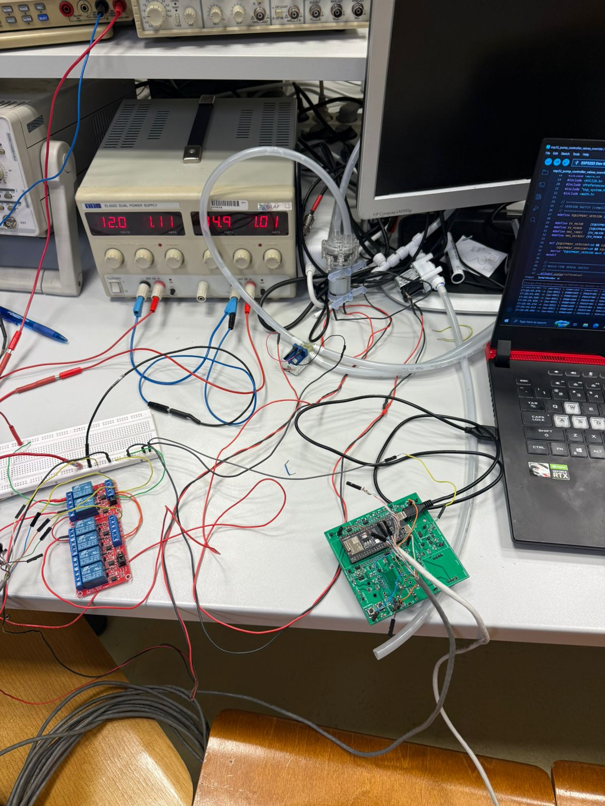

# Dehumidifier-Project

<p align="center">
  
</p>

```markdown

An open-source IoT controller for a pump-based dehumidifier system. The project uses an **ESP32-S3 Mini-1U** as the primary controller (Wi-Fi, optional HTTP upload) and optional **Arduino Nano** nodes for experiments. It manages one or two water containers, controls pump and valves, records **per-cycle water volume** (via calibration), supports **RTC-backed history**, and optional **GSM (SIM808)** for **SMS control** and status.

---

## Features

- **Dual-container management**: main + second container, with automatic switching and optional pipe purge.
- **Accurate volume tracking**: converts pump runtime (seconds) to liters using a calibration factor (L/min).
- **History & analytics**: daily totals, per-cycle volumes, pump starts; 10-day SMS history snapshot.
- **SMS control (SIM808)**: on-demand history, status, calibration, manual pump, and configuration commands.
- **RTC timestamps**: stable timekeeping for logs.
- **Optional server upload**: send JSON via HTTP to a simple backend for viewing data in a browser.

---

## Repository Layout

This repository currently organizes development sketches and iterations under `/Practice`. Each folder is a focused example or step in the evolution of the system.

> As the project stabilizes, these examples can be consolidated into a structured `firmware/`, `server/`, `dashboard/`, `hardware/`, and `docs/` layout.

---

## Hardware (Reference)

- **ESP32-S3 Mini-1U** (primary controller, Wi-Fi)
- **Float switches**: lower/upper for each container
- **Pump + valves** (including optional second-container and pipe-purge valve)
- **RTC (DS3231)** for stable timestamps
- **SIM808** module (optional) for SMS/calls/GPRS
- **Relay drivers**, wiring, and optional **current sensor** for fault detection

Pin mappings differ between sketches; see comments at the top of each example.

---

## Firmware Notes

- ESP32-S3 examples handle sensors, pump/valves, history, and optional Wi-Fi/HTTP + GSM.
- Nano/UNO examples are kept for learning, tests, and specific wiring setups.
- Some sketches implement **frozen/shorted pipe handling**: when pump current suggests blockage, divert to the second container instead of latching a hard fault.

---

## Calibration

To compute liters removed per pump cycle:

```

liters_this_cycle = (pump_seconds / 60.0) * liters_per_minute

```

- `liters_per_minute` is set via config or SMS (see `f=…` below).
- Typical calibration flow:
  1. Run a cycle into a known container (e.g., 2.00 L).
  2. Measure `pump_seconds`.
  3. Compute `L/min = (measured_liters * 60) / pump_seconds`.
  4. Store the value (EEPROM/NVS or SMS command).

---

## SMS Commands (SIM808)

> Exact availability may vary by example; sketches annotate which commands they implement.

- `H` — 10-day **history** (daily liters, pump starts; may send across multiple SMS if long)
- `R` — **Status** (levels, last cycle, today’s liters, calibration)
- `X` — **Clear history**
- `K` — **Start calibration** cycle (reports duration)
- `k` — **Clear calibration** (reset to default)
- `f=1.23` — **Set flow rate** to 1.23 L/min
- `M` — **Manual pump** toggle (safety-checked)
- `T=YYYY-MM-DD HH:MM:SS` — Set **RTC**
- `t` — Report **RTC now**
- `S` — Sessions/boot info
- `B` — Boot info
- `Z` — Reset boot counter

---

## History Format (Example)

A daily summary line sent via `H` might look like:

```

2025-10-16  water=2.0 L   starts=3   H1=45/56/78  H2=45/56/78  H3=45/56/78

```

Optional fields:
- `t1/t2/t3` for temperatures
- notes like `external pipe short`
- second-container pump-out can be excluded from history totals if configured that way

---

## Optional: Server & Browser Viewing

Some ESP32 sketches can POST JSON to a simple backend (e.g., FastAPI). A minimal API typically provides:

- `POST /api/ingest` — accept measurements with timestamp
- `GET /api/readings` — return recent rows for a browser dashboard

Frontends (e.g., Next.js) can fetch `GET /api/readings` and render tables or charts. Authentication can be as simple as a device token header for development.

---

## Versioning

The repository includes versioned example folders such as `V_2_1`, `V_2_2_*`, `V_2_3_*`, `V_2_4_*`. Annotated Git tags (e.g., `v2.2.0-esp32`) can be used alongside these directories when publishing releases.

---

## License

This project is open-source. Include a `LICENSE` file (e.g., MIT) at the repository root.
```
